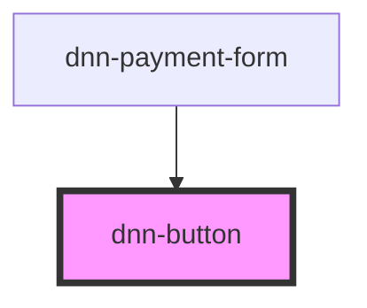

# dnn-button

<!-- Auto Generated Below -->

## Properties

| Property   | Attribute  | Description                                               | Type                                     | Default     |
| ---------- | ---------- | --------------------------------------------------------- | ---------------------------------------- | ----------- |
| `confirm`  | `confirm`  | If true will ask for confirmation before firing an event. | `boolean`                                | `false`     |
| `reversed` | `reversed` | If true, will reverse the button styles                   | `boolean`                                | `false`     |
| `size`     | `size`     | Defines the size of the button.                           | `"large" \| "small"`                     | `undefined` |
| `type`     | `type`     | Defines the type of button.                               | `"primary" \| "secondary" \| "tertiary"` | `"primary"` |

## Events

| Event       | Description                          | Type               |
| ----------- | ------------------------------------ | ------------------ |
| `confirmed` | The confirmable action was approved. | `CustomEvent<any>` |
| `declined`  | The confirmable action was declined. | `CustomEvent<any>` |

## Methods

### `disable(message: string) => Promise<void>`

Disabled the button and sets it's disabled message.

#### Returns

Type: `Promise<void>`

### `enable() => Promise<void>`

Re-enables a disabled button.

#### Returns

Type: `Promise<void>`

## CSS Custom Properties

| Name                 | Description                                 |
| -------------------- | ------------------------------------------- |
| `--background-color` | Defines the background-color of the button. |
| `--border-radius`    | Defines the radius of the button borders    |
| `--color`            | Defines the color of the button content     |
| `--padding`          | Defines the padding on the button           |

## Dependencies

### Used by

 - [dnn-payment-form](../dnn-payment-form)

### Graph

----------------------------------------------

*Built with [StencilJS](https://stenciljs.com/)*
